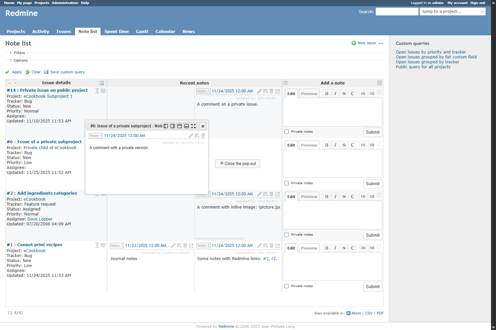

# Redmine Issue Note List Plugin

This is a Redmine plugin that lists issue notes (history) and allows you to add notes directly from the list view.

</img>

## Features

* **List Issue Notes**: View the recent notes of issues in a list format.
* **Add and Edit Notes Directly in the List View**: Add and edit new notes directly from the list view without navigating to the issue details page. You can also edit an existing note by double-clicking its cell.
* **Customize View**:
    * Adjust row height (fixed, variable)
    * Adjust column width
    * Compact mode
    * Use simple editor
    * Display notes in a popup window
* **Filtering**: Filter displayed issues using queries, similar to the standard issue list.

## Requirements

* Redmine
* [Redmine base deface plugin](https://github.com/jbbarth/redmine_base_deface)

## Installation

1. Go to your Redmine `plugins` directory.
2. Clone the repository.
   ```bash
   git clone https://github.com/sk-ys/redmine_issue_note_list.git
   ```
3. Install the dependency plugin (`redmine_base_deface`) if it is not already installed.
4. Restart Redmine.

## Usage

1. After installing the plugin, you need to configure permissions from the admin menu. Make sure to grant view and add rights for the "Note list" feature to the appropriate roles.
2. The plugin must be enabled for each project individually. Go to the project settings and activate the plugin as needed.
3. Once the plugin is enabled, "Note list" will be added to the application menu (top menu) and project menu.
4. Click "Note list" to view the list of issues and notes.
5. You can add notes or change view options from the input form in each row.

## License

GNU General Public License version 2 (GPLv2)

## Using Libraries

### Google Material Symbols
This product includes icons from the Google Material Symbols, which are licensed under the Apache License 2.0.
https://fonts.google.com/icons
